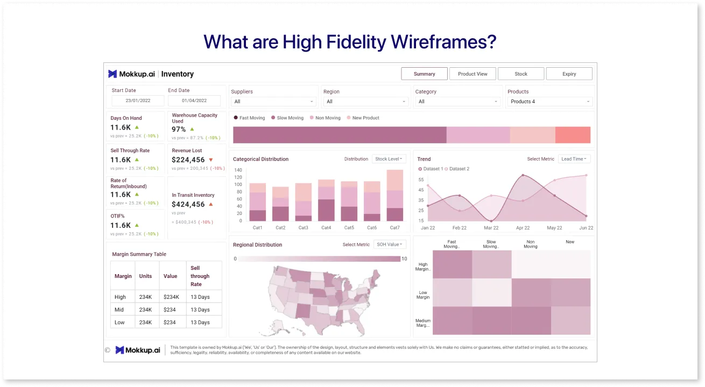

# DA4-WS5-PBI-NHS
Aplying NHS Style Guide

Start with intro to NHS Data Viz community of Practice

https://p-jacques.github.io/data-viz-community-of-practice/

This site is on Github, students need to have access.\
Some trusts have this blocked and students had to request ascess.\
These issues whould have been sorted out with the previous workshop.

### Students given two previously created PowerBI Dashboards
1. WS5 DS1 is the completed dashboard from the last workshop. Ask them to open this immediately
1. WS5 DS2 is a dashboard that has all margins and gaps done, waiting for fonts, shadows and padding

### Goal
The purpose of this workshop is to apply the Style Guide rules to the dashboard build in the previous workshop.\
The students could of course apply this to their own dashoards instead.

From the original 

To

# Slide 10: Intro to the Data Viz Community of Practice
## Draw attention to the contributors
Select the Acknowledgements tab and draw attention to the contributors of the material. \
This could be useful to know moving forward, check if anyone already knows some of the people involved.

https://p-jacques.github.io/data-viz-community-of-practice/

https://p-jacques.github.io/data-viz-community-of-practice/change_log/

# Dashboard Lifecycle

1. UAT: User Accecptance Testing
1. UCD: User-centered design (UCD) is an iterative design process in which designers focus on the users and their needs in each phase of the design process.
1. Talk through the `Light touch Lifecycle`
1. You can discuss the extra sections in the full lifcycle now if you wish
    1. Alfa: testing with a small user group
    1. Beta: With a larger user group

https://p-jacques.github.io/data-viz-community-of-practice/dashboard_lifecycle/

### Planning Cycle
Talk through the `Planning Cycle` making reference to the `Lifecycle` and asking for examples from the students.

https://p-jacques.github.io/data-viz-community-of-practice/dashboard_lifecycle/planning_cycle/

# Back to Slides

### Sketches and Protypes
There are a few stages of prototypes from Lo-fi Sketchs to Hi-Fi Mockups.\
The rigour in this process depends on the importance and audience of the dashboard.\
Lofi sketches can be done simply on paper or drawing basic shapes in Word or Excel, with the stakeholders.

__Note:__ Specialised Apps such as Mokkup.ai exist also

https://www.mokkup.ai/

### Lo-fi Sketches
Early stage, for exploring ideas and gatheringg feedback.\
Basic, low detail, focus on structure and layout

Used for:
1. Brainstorming
1. Early concept visualisation
1. Gather immediate feedback from stakeholders
1. Identify potential usability issues

https://medium.com/@mokkup/whats-the-difference-between-low-fidelity-and-high-fidelity-dashboard-wireframes-0afec8397ebc

### Hi-fi Wireframes

Late stage, more detailed and polished, will contain all elements in final product, fonts colours etc

Good for:
1. Final design iteration
1. Key stakeholder feedback
1. Developer handoff

https://medium.com/@mokkup/whats-the-difference-between-low-fidelity-and-high-fidelity-dashboard-wireframes-0afec8397ebc

## Leave the rest of the content in this section for the students to explore themselves.

# Style Guide Rules
Navigate to the Style guide Rules page via either
1. `Get started` or
1. `Style Guide` Rules

__Note:__ The Style guide rules are for Tableau, we will have to alter some of the instrutions and find workarounds to apply in PowerBi.\
By doing this the students will learn more functionality in PowerBi.\
There will be a few ways to approach some of the issues encountered, you or the students may know alternative methods and these could be explored.

### Style Guide Rules
1. Briefly introduce that you should set out a dashboard like a book.
1. Reading in a Z like pattern, although there are alternatives as all displays may not fit that pattern.
3. Give the students 10 min-15 mins to read and make personal notes on the `Key Principles` page.
    * https://p-jacques.github.io/data-viz-community-of-practice/dashboard_design/principles/#visual-hierarchy\
4. The most difficult in `Key Principles` is contrast, we will judge this by eye for the time being, it is a science in itself.\
Data to ink ratio does not have a link, but it appears to be taken from this article \
(Which in turn was taken from a University of Michegan resourse on Coursera) \
 https://www.codeconquest.com/blog/data-ink-ratio-explained-with-example/

Ask them to come write down ideas on how some of these could be empoyed to dashboards they have already made, will make, including what was done in the last workshop.

# Insert slide for conversation after students have read key principles

## NHS Logo - Back to style guide rules

https://p-jacques.github.io/data-viz-community-of-practice/dashboard_design/quick_summary/

Logo should be available in Aptem Zip folder with the previous completed Dashboard.\
Can also be downloaded from:\
* https://p-jacques.github.io/data-viz-community-of-practice/dashboard_design/icons/#nhs-logo\
(Office Use \ RGB Blue)

Import this logo to PowerBi.
1. Select `Insert` from the top ribbon
1. Choose `Image`
1. Select `RGB Blue` logo

When this logo is imported, PowerBI automatically makes it quite large.

In order to follow the guidelines we need to:
1. Ensure it is the right size
1. Ensure it is in the correct position

### Formatting the Logo Size: 
1. Select the logo
1. Select the `General` tab in `Format Image`
1. Select the `Properties` menu
1. in `Size` set the height and width to 40 and 100 respectively
1. Set the `Padding` to 0 on all borders

__Note:__ I noticed some glitchy behaviour here where te Width would snap to 96. Seems to happen when you try to drag the logo to a corner.

### Positioning the logo
The logo should be 32 pixels from the edges of the page.\
In Tableau you can set the borders for the page, so this task is trivial.\
It doesnt appear this functionality exists in PowerBI, I could be wrong, so we will set it manually.

__Note:__ You can change the Page resolution, but this will not have the desired effect.

It is worth noting the resolution we are working with in order to ensure we get the correct 32 pixel border:

1. Select white space on the page
1. Note the aspect ratio and resolution, this can help set the correct positions.

### Positioning the logo

1. Select the logo
1. Select the `General` tab in `Format Image`
1. Select the `Properties` menu
1. Under `Position` set:
    1. `Horizontal` to 1148 (1280 - 100 -32), width of logo and the margin
    1. `Vertical` to 32 

## Challenge - Back to slide

With 32 Pixel borders all around the dashboard looks like this:

Move charts to get the desired border. \
Select the slicer line chart and bar chart and set horizontal position to 32. \
Use the snap feature to set the right hand margins.

## Following General Layout
Here are the general layout principles.

1. 32px margin on all sides of the dashboard as per NHS England identity guidelines.
1. 16px padding on top, bottom, left and right of cards. For further information visit the cards page.
1. 32px spacing between cards on the dashboard.
1. Minimum font size 11px or 11pt. (states 10 for captions later)
1. Utilise various weights (bolder or thinner) to establish a hierarchy. Be consistent in size, boldness and colour.
1. All text should be sentence case.
1. Dashboard background colour #F0F4F5 (NHS Grey 5).
1. If the viz is going to show more data (more lines/bars) use the full width card so it helps the user to digest information quickly.

* https://p-jacques.github.io/data-viz-community-of-practice/dashboard_design/layout/#header-section

The students will address at least 1,3 and 7 in the breakout room.

## Breakout rooms challenge

Ask the students to apply as many of the general layout rules as the can.
The rest of the charts will need to be resized and moved around a little bit to accomodate.

Below is the position and size of the bar chart.\
 Note the `Vertical position` and `height` add to 688, meaning there is a 32 pixel border in the 720 display.\
  224 + 464 = 688

## Typography

https://p-jacques.github.io/data-viz-community-of-practice/dashboard_design/typography/#font-specification

Look at the guidance for fonts and language. \
How to set default fonts in PowerBI

1. Select `View` in the top ribbon
1. Select `Customise Current Theme` in the theme dropdown menu

Set all defaults text to Ariel

1. Select `Text`
1. Go through all options
1. Select the desired font
1. Apply the settings

## Second breakout room

Address Fonts, padding and shadows.

## Fonts are straightforward

## Padding

1. `Format visual`
1. `General` Tab
1. `Padding` menu, 16px for all sides

## Shadows

1. Select `Format visual`
1. `General` Tab
1. `Effects`
1. Under `Shadow` select
    1. Colour, #D8DBDC
    1. Offset, outside
    1. Position, Outside
    1. Size, 0
    1. Blur, 0
    1. Angle, 90
    1. Distance,2
    1. Transparancy, 2

